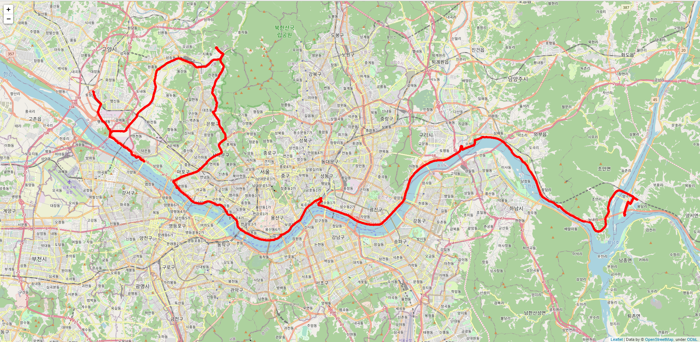
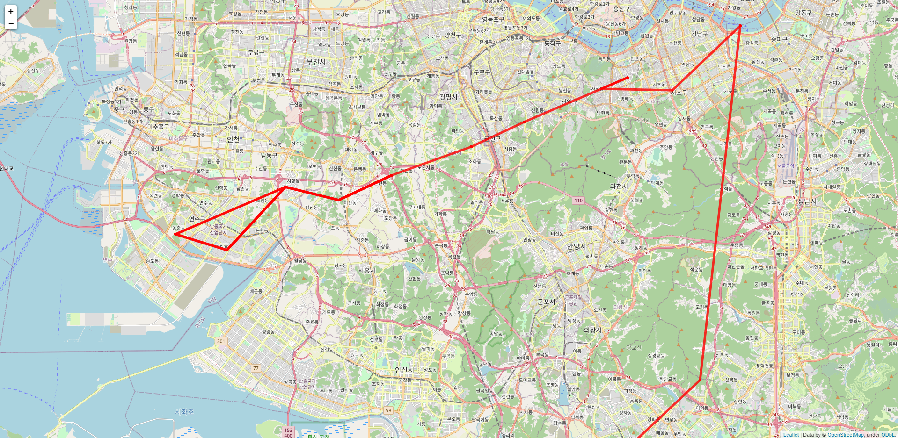

# 자전거 GPS Log 기반 미등록 구간 추출
약 40만개의 자전거 GPS Log data를 활용하여 기존에 존재하지 않던 segment를 추출하는 task입니다.  

### Segment
**Segment**란, GEOJson 내에 저장된 지형의 시작점/끝점 좌표를 추출한 도로 정보로, 경로 추천에 활용합니다.  
추출된 도로 정보는 차로를 기반으로 만들어진 정보이기 때문에 자전거가 다닐 수 있는 길에 대한 segment는 존재하지 않습니다.  
  
이를 **미등록 구간**이라고 정의합니다.  

### Log Data
각 자전거 Log data는 위도, 경도 정보를 기반으로 2초 간격으로 기록되어 있고,  
matching algorithm을 통해 가장 가까운 segment가 매칭되어 행마다 같이 기록되어 있습니다.  
  
즉, 각 행마다 **위도/경도**, **GEOJson 파일명**(tile의 X, Y 좌표), **segment의 시작점/끝점의 위도/경도**가 기록되어 있습니다.  

### 사용한 모델, 입력 데이터
각 경로 파일은 시계열 데이터이기 때문에 LSTM 모델을 활용하기로 하였고,  
미등록 구간을 이상치로 간주하여 LSTM Autoencoder를 활용하여 이상 탐지를 시도하였습니다.  
각 경로 파일 1개를 입력 데이터 1개로 사용했습니다.

## 모델 학습 환경
> Python, Keras

## 시도 
> https://github.com/ssfic3380/Unregistered_Road_Detection/history

## 결과 (실패)

  
  

## 한계점
* 교수님의 지도를 받으며 LSTM에 대해서 학습했지만, 이해가 부족했다.
* 각 경로의 embedding을 생성하여 입력 데이터로 사용해보지 못했다.
* 이상 탐지 외에 다른 방법을 사용해보지 못했다.
